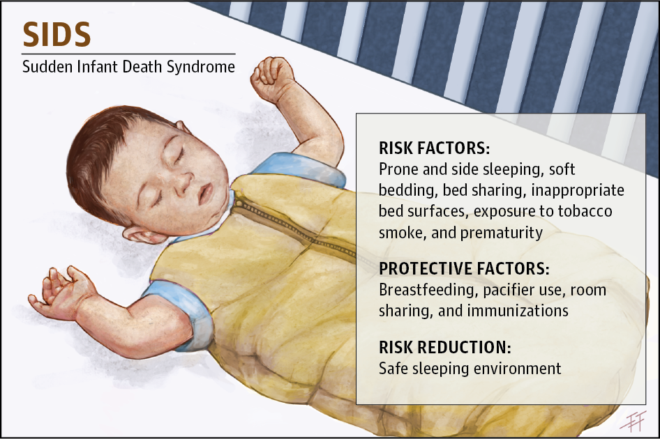

--- 
title: "SIDS-Related Mortality in Cook County, IL"
author: "Daniel P. Hall Riggins"
date: "2022-02-20"
site: bookdown::bookdown_site
documentclass: book
bibliography: [book.bib, packages.bib]
# url: your book url like https://bookdown.org/yihui/bookdown
# cover-image: path to the social sharing image like images/cover.jpg
description: |
  An public health analysis of SIDS-related mortality
biblio-style: apalike
csl: chicago-fullnote-bibliography.csl
---

# SIDS-Related Mortality in Cook County, IL

## About

This analysis seeks to describe, map, and model the number of Sudden Infant Death Syndrome (SIDS)-related deaths in Cook County, IL census tracts for the purposes of public health interventions.

*Image credit to [JAMA Pediatrics](https://jamanetwork.com/journals/jamapediatrics/fullarticle/2599897)*

